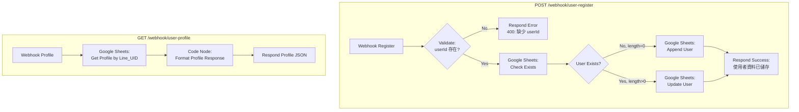
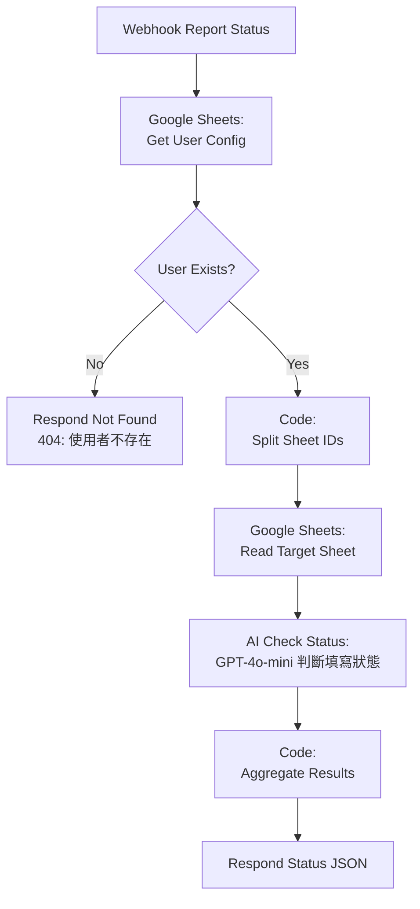
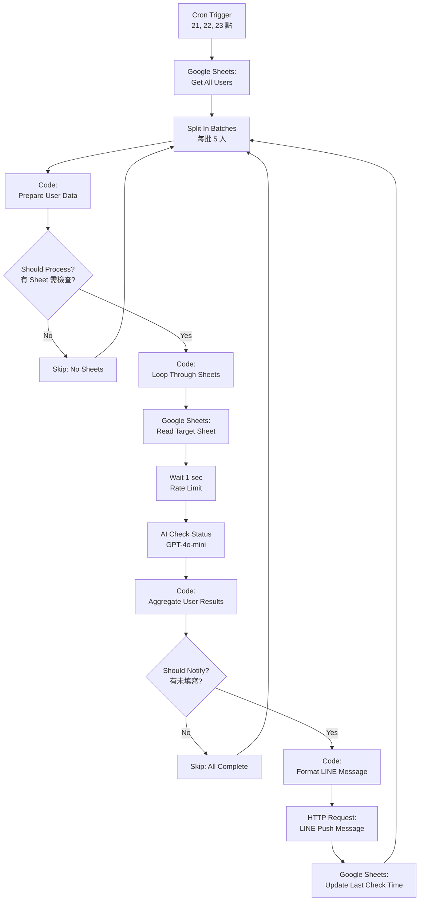

# n8n Workflow 流程圖

> 本文件包含三大 Workflow 的 Mermaid 流程圖，供開發參考。

---

## Workflow A：使用者資料管理 API

### 端點
- `POST /webhook/user-register` - 註冊/更新使用者
- `GET /webhook/user-profile` - 取得使用者資料

### 流程圖

### 節點說明

| 節點名稱 | 類型 | 說明 |
|---------|------|------|
| Webhook Register | n8n-nodes-base.webhook | POST 接收註冊請求 |
| Validate Register Data | n8n-nodes-base.if | 檢查 userId 是否存在 |
| Google Sheets - Check Exists | n8n-nodes-base.googleSheets | 查詢使用者是否已存在 |
| User Exists? | n8n-nodes-base.if | 判斷是新增還是更新 |
| Google Sheets - Append User | n8n-nodes-base.googleSheets | 新增使用者資料 |
| Google Sheets - Update User | n8n-nodes-base.googleSheets | 更新使用者資料 |
| Respond Success | n8n-nodes-base.respondToWebhook | 回傳成功訊息 |
| Respond Error | n8n-nodes-base.respondToWebhook | 回傳錯誤訊息 (400) |

---

## Workflow B：報表狀態查詢 API

### 端點
- `GET /webhook/report-status?userId=xxx` - 取得報表填寫狀態

### 流程圖

### 節點說明

| 節點名稱 | 類型 | 說明 |
|---------|------|------|
| Webhook Report Status | n8n-nodes-base.webhook | GET 接收狀態查詢 |
| Get User Config | n8n-nodes-base.googleSheets | 從 Master_Sync 取得使用者設定 |
| User Exists? | n8n-nodes-base.if | 檢查使用者是否存在 |
| Split Sheet IDs | n8n-nodes-base.code | 將 Sheet IDs 拆分為多個項目 |
| Read Target Sheet | n8n-nodes-base.googleSheets | 讀取各個目標報表 |
| AI Check Status | @n8n/n8n-nodes-langchain.openAi | AI 判斷填寫狀態 |
| Aggregate Results | n8n-nodes-base.code | 彙整所有報表狀態 |
| Respond Status | n8n-nodes-base.respondToWebhook | 回傳狀態 JSON |

---

## Workflow C：定時推播通知 (Cron)

### 觸發
- Cron: 每日 21:00, 22:00, 23:00

### 流程圖

### 節點說明

| 節點名稱 | 類型 | 說明 |
|---------|------|------|
| Cron Trigger | n8n-nodes-base.scheduleTrigger | 定時觸發 (21, 22, 23 點) |
| Get All Users | n8n-nodes-base.googleSheets | 取得所有使用者 |
| Split In Batches | n8n-nodes-base.splitInBatches | 分批處理避免超載 |
| Prepare User Data | n8n-nodes-base.code | 解析使用者設定 |
| Should Process? | n8n-nodes-base.if | 檢查是否有 Sheet 需監測 |
| Loop Through Sheets | n8n-nodes-base.code | 展開 Sheet 清單 |
| Read Target Sheet | n8n-nodes-base.googleSheets | 讀取目標報表 |
| Wait (Rate Limit) | n8n-nodes-base.wait | 延遲 1 秒避免 API 限制 |
| AI Check Status | @n8n/n8n-nodes-langchain.openAi | AI 判斷填寫狀態 |
| Aggregate User Results | n8n-nodes-base.code | 彙整使用者結果 |
| Should Notify? | n8n-nodes-base.if | 檢查是否需要通知 |
| Format LINE Message | n8n-nodes-base.code | 格式化 LINE 訊息 |
| LINE Push Message | n8n-nodes-base.httpRequest | 發送 LINE 推播 |
| Update Last Check Time | n8n-nodes-base.googleSheets | 更新最後檢查時間 |

---

## 資料欄位對照

### Master_Sync 表格欄位

| 欄位名稱 | 說明 | 範例 |
|---------|------|------|
| Line_UID | LINE 唯一 ID | U8429... |
| Real_Name | 真實姓名 | 張大明 |
| Aliases | 別名 (逗號分隔) | 張大明,小張,大明 |
| Target_Sheet_IDs | 關注的 Sheet ID | ID_1,ID_2 |
| Sheet_Configs | Sheet 欄位配置 (JSON) | {"ID_1": {...}} |
| Created_At | 建立時間 | 2026-01-05 10:00:00 |
| Updated_At | 更新時間 | 2026-01-06 15:30:00 |
| Last_Check_Time | 最後推播檢查時間 | 2026-01-06 21:05:00 |

---

## 已知問題

### Google Sheets Update 節點 matchingColumns 錯誤

**問題**：透過 JSON 匯入的 Workflow，Google Sheets Update 節點會出現 `Could not get parameter: columns.matchingColumns` 錯誤。

**原因**：n8n v4.5 的 Google Sheets 節點使用 `resourceMapper` 類型，需要完整的 `schema` 和 `matchingColumns` 屬性，而這些屬性需要在 n8n UI 中選擇 Sheet 後才會自動產生。

**解決方法**：
1. 在 n8n UI 中刪除出錯的 Google Sheets Update 節點
2. 重新拉一個新的 Google Sheets 節點
3. 設定 Operation: Update Row
4. 選擇 Document 和 Sheet (讓 n8n 自動載入欄位)
5. 設定 Column to Match On: Line_UID
6. 填入要更新的欄位值
7. 重新連接節點
